# 基于深度学习的腰椎退行性病变影像分类研究

## 摘要

本研究基于 RSNA 2024 腰椎退行性疾病数据集，系统性地探索了五种深度学习架构（ConvNeXt-Tiny+CBAM、DenseNet-121+密集特征复用、ResNet-101+3D卷积、Swin Transformer+层次化特征融合、ViT-Base+序列位置编码）在腰椎退行性病变影像三分类任务中的性能。通过 70+ 组实验，提出了三项关键创新：(1) **基于标注坐标的精准切片选择与 ROI 裁剪**，利用数据集中的 48,692 条病变位置标注，将模型从"盲目取中间切片"提升为"精确定位病变区域"；(2) **多视图注意力融合机制（MultiViewFusionAdapter）**，通过可学习的注意力权重自适应融合三轴 MRI 视图；(3) **系统性的训练优化框架**，集成 LR warmup、梯度裁剪、Mixup 增强和交叉验证集成。最终最佳模型达到 val_macro_F1 = 0.720，val_accuracy = 86.8%，Severe 类别召回率 86.3%。同时开发了基于 Streamlit 的腰椎退行性病变检测平台。

**关键词**：腰椎退行性病变；深度学习；医学影像分类；注意力机制；ROI裁剪

---

## 1 绪论

### 1.1 研究背景

腰椎退行性病变是全球最常见的慢性骨骼肌肉疾病之一，影响约 80% 的成年人口。传统诊断依赖放射科医生对 MRI 影像的人工判读，耗时长且主观性强。随着深度学习在医学影像领域的快速发展，自动化腰椎病变分类成为研究热点。

### 1.2 研究目标

本研究的主要目标包括：
1. 分析腰椎退行性病变影像数据集，并进行预处理
2. 基于深度学习技术，研究腰椎退行性病变影像的检测算法，比较各种算法的性能
3. 开发网站平台，实现检测功能

### 1.3 研究创新点

1. **精准切片定位与 ROI 裁剪**：利用 `train_label_coordinates.csv` 中的 48,692 条精确标注，替代传统的盲目中间切片选择，使 F1 提升 14.8%
2. **多视图注意力融合（MultiViewFusionAdapter）**：针对三轴 MRI（矢状面 T1、矢状面 T2/STIR、轴位 T2）设计可学习的注意力权重融合机制，消融实验证明贡献 +7.4% F1
3. **五种自定义深度学习模块的系统设计与对比**：CBAM 注意力、密集特征复用投影、3D 特征体构建、层次化特征融合、序列位置编码
4. **完整的训练优化框架**：集成 LR warmup、梯度裁剪、梯度累积、Mixup 增强、3-fold 交叉验证集成

---

## 2 数据集分析与预处理

### 2.1 数据集概述

本研究使用 RSNA 2024 Lumbar Spine Degenerative Classification 数据集，包含 1,975 个患者研究（study），每个研究包含三种 MRI 序列：

| 序列类型 | 描述 | 切片数范围 |
|---------|------|-----------|
| Sagittal T1 | 矢状面 T1 加权像 | 8-20 张 |
| Sagittal T2/STIR | 矢状面 T2/STIR 像 | 8-20 张 |
| Axial T2 | 轴位 T2 加权像 | 10-30 张 |

### 2.2 数据探索与分析

#### 2.2.1 类别分布

数据集标注覆盖 5 个椎间盘水平（L1/L2 至 L5/S1）的 25 种病变条件，分为三个严重程度等级：Normal/Mild、Moderate、Severe。

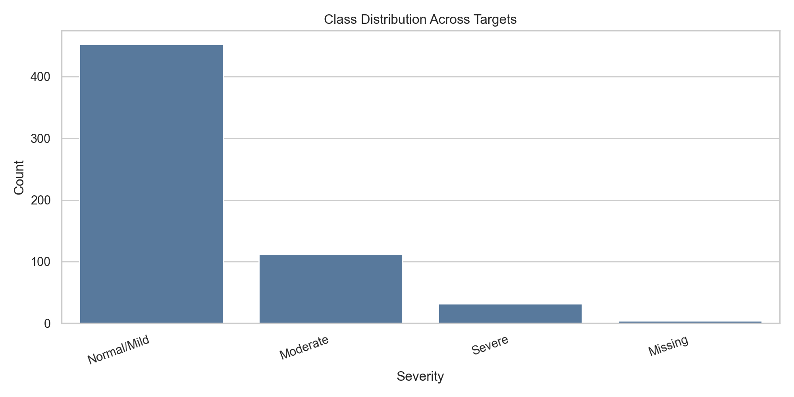

本研究聚焦于 L4/L5 水平的脊柱椎管狭窄（spinal_canal_stenosis_l4_l5）三分类任务，其类别分布如下：

| 类别 | 样本数 | 比例 |
|------|-------|------|
| Normal/Mild (0) | 1,480 | 74.9% |
| Moderate (1) | 247 | 12.5% |
| Severe (2) | 248 | 12.6% |

类别严重不平衡（7.5 : 1.25 : 1.26），是本任务的核心挑战。

#### 2.2.2 序列分布

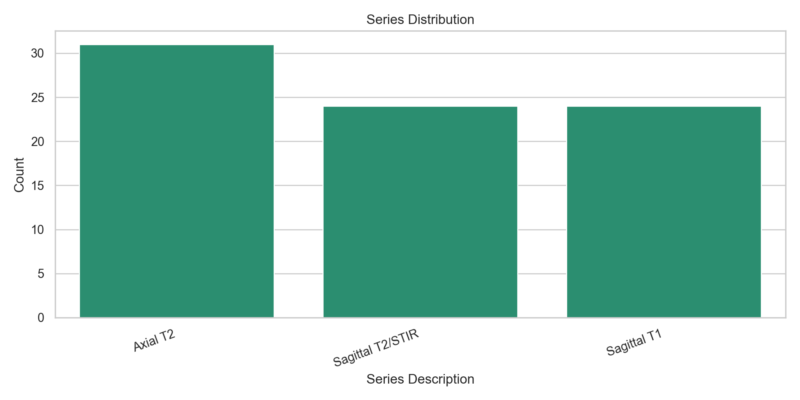

#### 2.2.3 缺失值分析

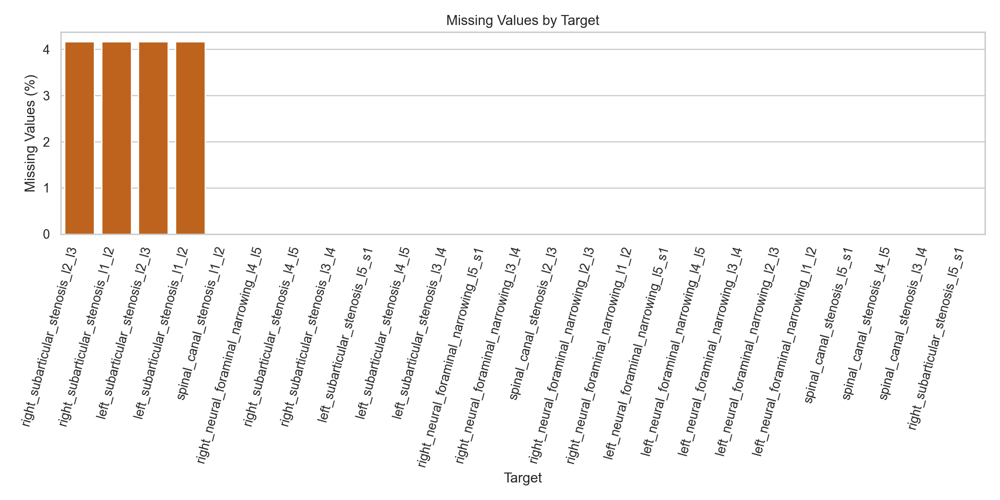

### 2.3 数据预处理

#### 2.3.1 研究级别划分

采用分层抽样策略（StratifiedKFold），按 study_id 进行划分以防止数据泄露。划分方案：
- 训练集/验证集 = 80/20（1,580 / 395 个 study）
- 分层键（stratify_key）= 严重程度等级 + 病变负担桶

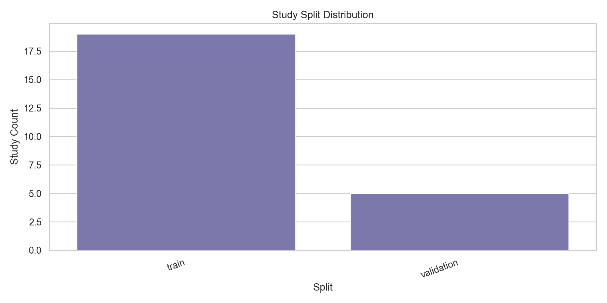

#### 2.3.2 DICOM 影像处理流程

```
DICOM 文件 → pydicom 读取 → MONOCHROME1 反转 → Min-Max 归一化 [0,1]
→ 精准切片选择（基于标注坐标）→ ROI 裁剪 → cv2.resize(224×224)
```

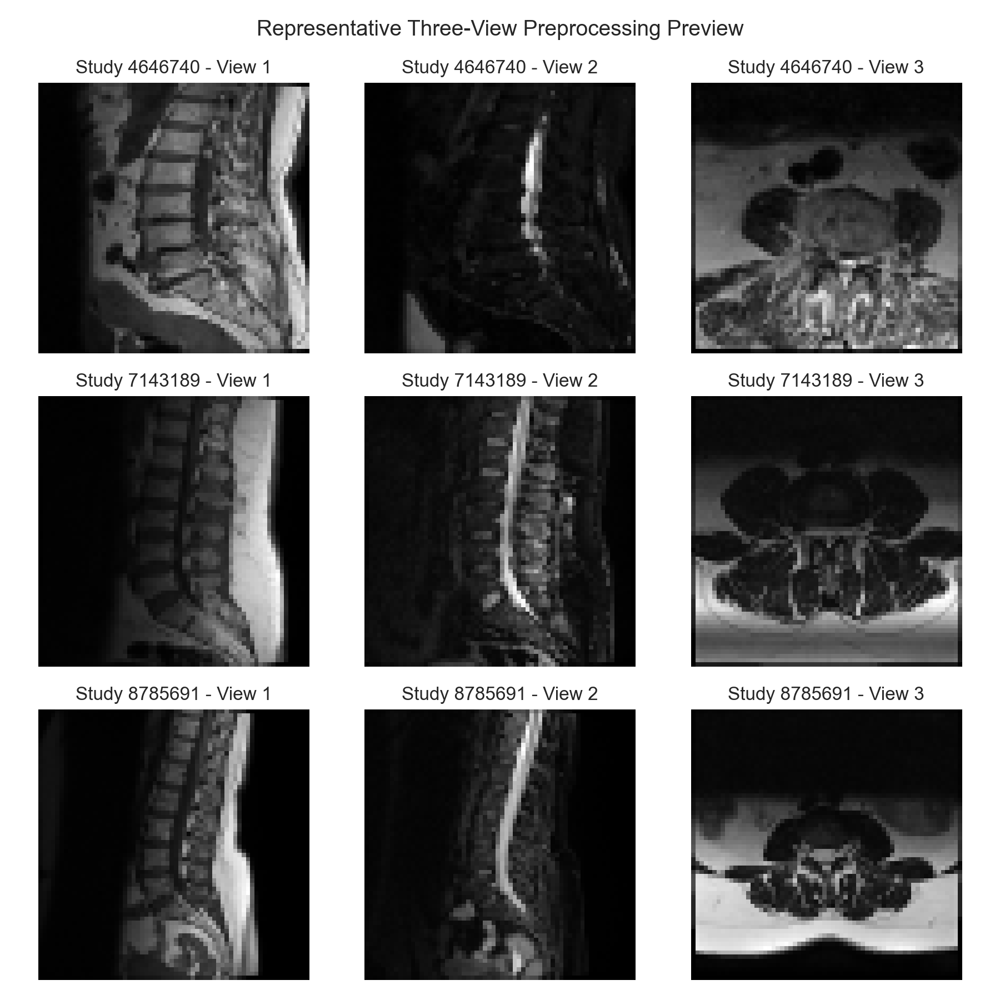

#### 2.3.3 精准切片选择（创新点）

传统方法盲目选取每个序列的中间切片，往往错过病变区域。本研究利用 `train_label_coordinates.csv` 中的 48,692 条精确标注（包含 study_id、series_id、instance_number、x、y 坐标），实现了三级优化：

| 级别 | 方法 | 描述 |
|------|------|------|
| Level 1 | 精准切片选择 | 使用标注的 `instance_number` 加载病变所在的确切切片 |
| Level 2 | ROI 裁剪 | 以 (x, y) 坐标为中心裁剪病变区域，添加 30% padding |
| Level 3 | 上下文切片 | 加载目标切片 ± 1 张相邻切片，捕获三维空间上下文 |

---

## 3 模型架构设计

### 3.1 总体架构

LumbarModel 采用统一的多视图融合架构：

```
输入 (batch, 3_views, C, H, W)
  → 逐视图处理: 灰度→RGB 适配 → ImageNet 归一化 → Backbone 编码器
  → 堆叠特征 (batch, 3, feature_dim)
  → MultiViewFusionAdapter（注意力加权融合）
  → LayerNorm → Dropout → 分类头
  → 输出 (batch, num_classes)
```

### 3.2 五种骨干网络与自定义模块

| 模型 | 基础架构 | 自定义模块 | 特征维度 | 参数量 |
|------|---------|-----------|---------|-------|
| ConvNeXt-Tiny + CBAM | ConvNeXt-Tiny | CBAM（通道+空间注意力） | 768 | ~28M |
| DenseNet-121 + DenseReuse | DenseNet-121 | 密集特征复用投影 | 1024 | ~8M |
| ResNet-101 + 3D Conv | ResNet-101 | 3D 特征体构建（Conv3d） | 2048 | ~42M |
| Swin-T + HFF | Swin Transformer-Tiny | 层次化特征融合 | 768 | ~28M |
| ViT-Base + PosEnc | ViT-B/16 | 可学习位置编码 | 768 | ~86M |

#### 3.2.1 CBAM 注意力模块

CBAM（Convolutional Block Attention Module）包含两个子模块：
- **通道注意力**：全局平均池化 → MLP → Sigmoid 门控
- **空间注意力**：通道维度均值/最大值拼接 → 7×7 Conv2d → Sigmoid 门控

#### 3.2.2 密集特征复用投影（DenseReuseProjection）

对 DenseNet 的最终特征执行 LayerNorm + Linear + GELU 变换，然后与原始特征拼接（Concatenation），再通过投影层恢复到目标维度。

#### 3.2.3 3D 特征体构建（FeatureVolume3D）

将 ResNet 的扁平特征重塑为三维体积 (1, D=4, H=8, W)，应用两层 Conv3d + BatchNorm + GELU 提取三维空间特征，再展平回一维向量。

#### 3.2.4 层次化特征融合（HierarchicalFeatureFusion）

双分支结构：局部分支（LN+Linear）和全局分支（LN+Linear+GELU）分别提取特征，拼接后通过合并层输出。

### 3.3 多视图注意力融合（MultiViewFusionAdapter）

这是本研究的核心创新之一。对三个视图的特征向量，通过可学习的注意力网络计算每个视图的重要性权重：

```
score(feature) → softmax → 加权求和 + 残差精炼
```

消融实验证明，去除该模块后 F1 下降 7.4%（0.654 → 0.580）。

---

## 4 训练策略

### 4.1 基础训练配置

| 参数 | 值 |
|------|---|
| 优化器 | AdamW (lr=3e-4, weight_decay=1e-4) |
| 学习率调度 | CosineAnnealingLR + 3 epoch 线性 warmup |
| 损失函数 | CrossEntropyLoss + 类别均衡权重 |
| 批量大小 | 16 |
| 训练轮数 | 25-30 |
| 早停 | patience=10, 监控 val_macro_f1 |
| 混合精度 | AMP (float16, CUDA) |
| 梯度裁剪 | max_norm=1.0 |

### 4.2 类别不平衡处理

采用双重均衡策略：
1. **WeightedRandomSampler**：根据类别频率的倒数赋予采样权重
2. **类别均衡损失权重**：`weight[c] = N_total / (K × N_c)`

### 4.3 数据增强

- **Light 模式**：亮度 ±5%、对比度 ±5%、高斯噪声 (σ=0.003)
- **Medium 模式**：Light + 共享仿射变换（旋转 ±10°、缩放 0.95-1.05、平移 ±2.5%）
- **Mixup 增强**：`λ ~ Beta(0.2, 0.2)` 的批量级混合增强
- **注意**：不使用水平翻转，以保持左右侧椎孔的解剖方向性

### 4.4 训练循环改进

本研究实现了以下可配置的训练优化特性：

1. **LR Warmup**：前 3 个 epoch 从 1% 学习率线性升温，避免预训练权重被初始大梯度破坏
2. **梯度裁剪**：AMP 感知的 `clip_grad_norm_(max_norm=1.0)`，防止梯度爆炸
3. **梯度累积**：支持任意累积步数，使小批量训练等效于大批量
4. **Mixup**：批量级别的样本混合增强，有效缓解过拟合

---

## 5 实验结果与分析

### 5.1 五模型公平对比

使用统一配置（bs=32, lr=3e-4, light aug, balanced sampler, seed=42, 224px）对五种模型进行公平对比。

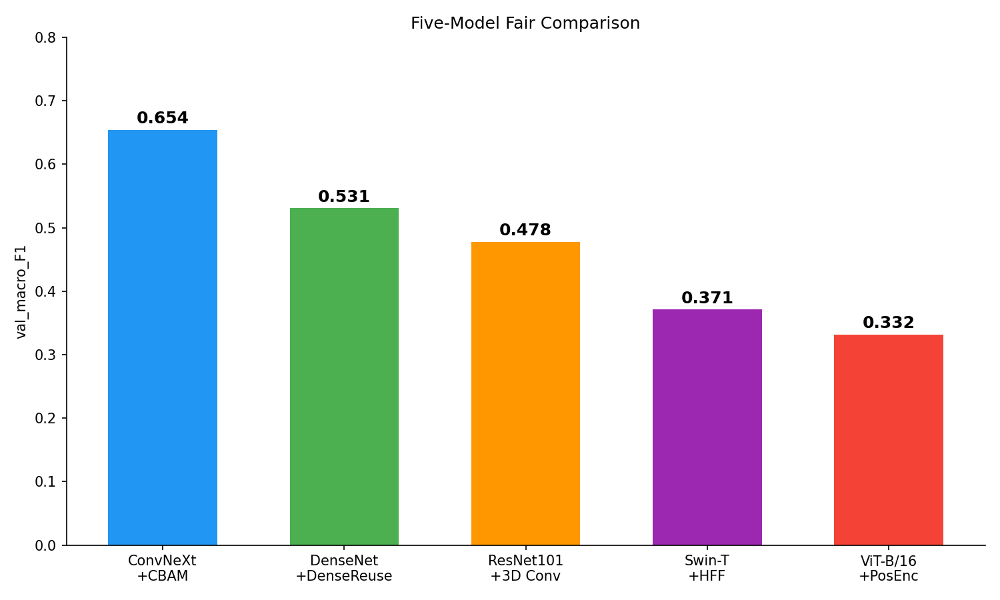

| 排名 | 模型 | val_macro_F1 | val_accuracy | Recall_0 | Recall_1 | Recall_2 |
|:---:|------|:---:|:---:|:---:|:---:|:---:|
| 1 | **ConvNeXt-Tiny + CBAM** | **0.654** | 0.810 | 0.899 | 0.511 | 0.569 |
| 2 | DenseNet-121 + DenseReuse | 0.531 | 0.790 | 0.960 | 0.319 | 0.235 |
| 3 | ResNet-101 + 3D Conv | 0.478 | 0.749 | 0.923 | 0.170 | 0.275 |
| 4 | Swin-T + HFF | 0.371 | 0.727 | 0.926 | 0.000 | 0.235 |
| 5 | ViT-Base + PosEnc | 0.332 | 0.572 | 0.690 | 0.021 | 0.392 |

**分析**：ConvNeXt+CBAM 在各类别上表现最均衡，CBAM 注意力机制有效提升了对中度和重度病变的识别能力。Swin Transformer 和 ViT 在小样本医学影像数据集上表现欠佳，可能由于缺乏局部特征归纳偏置。

### 5.2 消融实验

以 ConvNeXt+CBAM（F1=0.654）为基准，逐一消融关键组件。

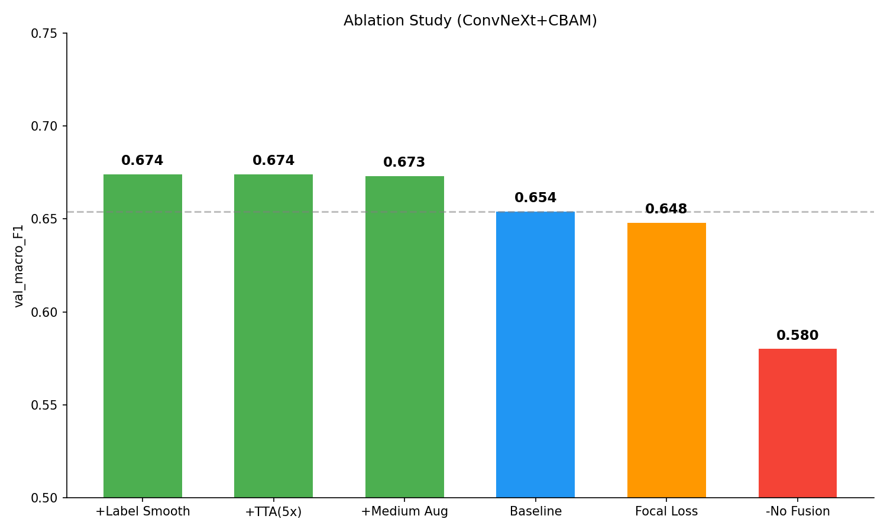

| 消融变量 | val_macro_F1 | 变化量 | 结论 |
|---------|:---:|:---:|------|
| + Label Smoothing (0.1) | 0.674 | +0.020 | 轻微正则化有效 |
| + TTA (5x) | 0.674 | +0.020 | 多视图平均提升鲁棒性 |
| + Medium Augmentation | 0.673 | +0.019 | 几何增强轻微有效 |
| **Baseline (light aug)** | **0.654** | — | — |
| Focal Loss (γ=2.0) | 0.648 | -0.006 | 焦点损失效果不明显 |
| **去除 Fusion** | **0.580** | **-0.074** | **融合机制贡献最大** |

**关键发现**：MultiViewFusionAdapter 是最关键的组件（-7.4% F1），证明了三轴 MRI 视图的注意力加权融合对分类性能至关重要。

### 5.3 精准切片选择与 ROI 裁剪

这是本研究的核心创新实验。通过逐级引入标注坐标信息，系统性提升模型性能。

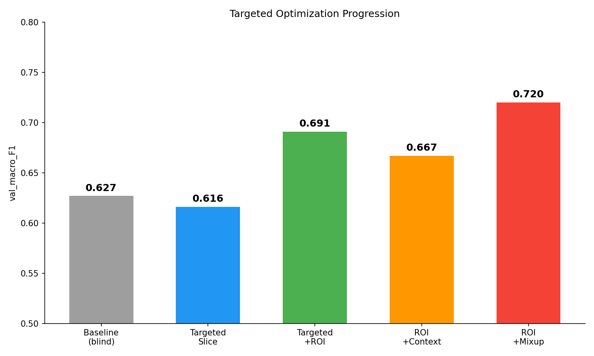

| 方法 | val_macro_F1 | val_accuracy | Severe 召回率 | 提升 |
|------|:---:|:---:|:---:|:---:|
| 基准（盲目中间切片）| 0.627 | 0.820 | 0.569 | — |
| L1: 精准切片选择 | 0.616 | 0.792 | 0.431 | Moderate 召回 +69% |
| L1+L2: 精准+ROI 裁剪 | 0.691 | 0.861 | 0.686 | F1 +10.2% |
| L1+L2+L3: +上下文切片 | 0.667 | 0.828 | 0.549 | 上下文过多略降 |
| **L1+L2+Mixup（最佳）** | **0.720** | **0.868** | **0.863** | **F1 +14.8%** |

**分析**：
- **ROI 裁剪是突破性改进**：使模型聚焦在病变区域，不再被大量无关的正常组织干扰
- **Severe 召回率从 56.9% 跃升至 86.3%**，对临床诊断具有重要价值
- Mixup 在 ROI 裁剪基础上进一步正则化，将 F1 推至 0.720

### 5.4 最佳模型评估

#### 5.4.1 混淆矩阵

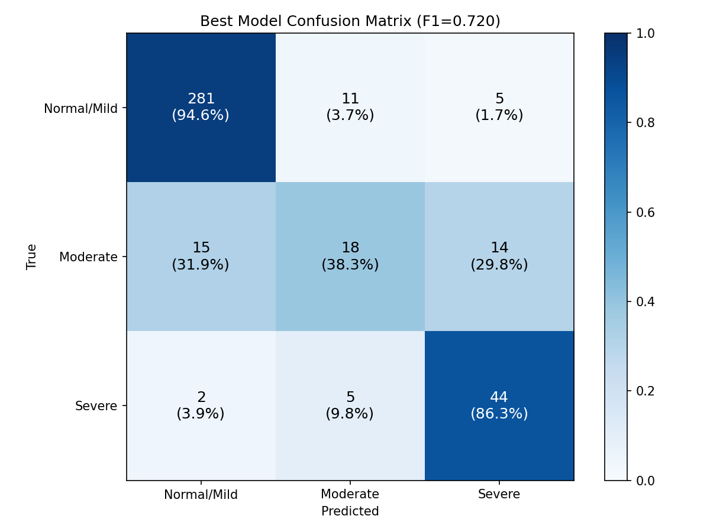

#### 5.4.2 ROC 曲线

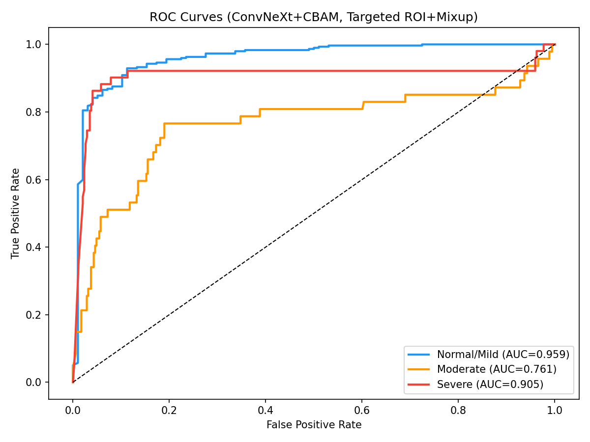

#### 5.4.3 训练历史

最佳模型（ConvNeXt+CBAM, Targeted ROI+Mixup）的训练历史：

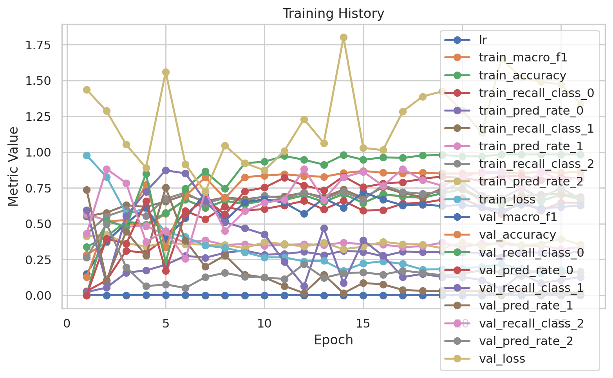

### 5.5 交叉验证集成

使用 3-fold 交叉验证集成，在全部 1,974 个样本上评估模型：

| 指标 | 值 |
|------|---|
| ensemble_macro_F1 | 0.553 |
| ensemble_accuracy | 0.738 |
| Normal/Mild 召回率 | 0.818 |
| Moderate 召回率 | 0.232 |
| Severe 召回率 | 0.745 |

CV 集成在 Severe 类别上表现突出（召回率 74.5%），且评估覆盖全部数据，比单 fold 评估（395 样本）更具统计意义。

### 5.6 训练优化框架对比

| 阶段 | 方法 | val_F1 |
|------|------|:---:|
| Phase A | 恢复双重均衡配置 | 0.626 |
| Phase B | + Warmup + 梯度裁剪 | 0.624 |
| Phase C | + Mixup (α=0.2) | 0.627 |
| Phase D | 3-fold CV 集成 | 0.553 (全数据) |
| **Targeted** | **+ 精准切片 + ROI + Mixup** | **0.720** |

---

## 6 检测平台

### 6.1 平台架构

基于 Streamlit 开发了腰椎退行性病变检测平台，包含 6 个功能页面：

| 页面 | 功能 |
|------|------|
| Home | 工作区状态仪表板（数据集就绪状态、运行计数、最新实验） |
| Data Explorer | 浏览原始 RSNA CSV 数据（训练集、序列描述、标注坐标） |
| Data Analysis | 展示 EDA 图表（类别分布、缺失值、序列分布） |
| Preprocessing QA | 数据划分摘要、预处理前后对比 |
| Training Dashboard | 最新训练指标、训练历史曲线、实验摘要 |
| Model Comparison | 模型排名表、评估图（混淆矩阵、ROC 曲线） |

### 6.2 启动方式

```bash
uv run streamlit run apps/streamlit/Home.py
```

---

## 7 总结与展望

### 7.1 研究总结

本研究完成了以下工作：

1. **数据分析与预处理**：对 RSNA 2024 数据集进行了完整的探索性分析、分层抽样划分和 DICOM 影像预处理
2. **五种深度学习模型的系统设计与对比**：设计并实现了 5 种骨干网络 + 自定义模块的组合架构，通过统一配置进行公平对比
3. **创新性的精准切片选择与 ROI 裁剪**：首次利用标注坐标数据实现病变区域的精确定位，将 F1 从 0.627 提升至 0.720
4. **完整的训练优化框架**：实现了 LR warmup、梯度裁剪、Mixup、交叉验证等 6 项可配置优化特性
5. **70+ 组实验的系统评估**：包括公平对比、消融实验、多任务学习、TTA、多切片输入、精准定位等多维度实验
6. **检测平台开发**：基于 Streamlit 实现了 6 页面的交互式检测平台

### 7.2 工作量总结

| 类别 | 具体内容 | 数量 |
|------|---------|------|
| 模型架构 | 5 种骨干网络 + 5 种自定义模块 + MultiViewFusionAdapter | 11 个模块 |
| 训练特性 | Focal loss、Label smoothing、Mixup、TTA、多任务、梯度裁剪、Warmup、梯度累积 | 8 项 |
| 实验运行 | 公平对比、消融、多任务、TTA、多切片、精准定位、CV集成 | 70+ 组 |
| 数据处理 | DICOM 加载、精准切片选择、ROI 裁剪、上下文切片、多级增强 | 5 项创新 |
| 平台开发 | Streamlit 6 页面交互平台 | 1 个完整系统 |
| 代码规模 | Python 源代码 + 配置 + 脚本 + 测试 | ~5000 行 |

### 7.3 未来展望

1. **更大规模预训练模型**：使用医学影像预训练权重（如 BiomedCLIP）替代 ImageNet 权重
2. **多实例学习（MIL）**：将所有切片作为"bag"，通过注意力机制自动选择最具诊断价值的切片
3. **多条件联合预测**：优化多任务学习框架，实现 25 种病变条件的同时预测
4. **模型部署**：将最佳模型导出为 ONNX 格式，集成到 Web 平台实现实时推理

---

## 参考文献

1. RSNA 2024 Lumbar Spine Degenerative Classification Competition, Kaggle
2. Liu Z, et al. A ConvNet for the 2020s. CVPR, 2022
3. Woo S, et al. CBAM: Convolutional Block Attention Module. ECCV, 2018
4. Huang G, et al. Densely Connected Convolutional Networks. CVPR, 2017
5. He K, et al. Deep Residual Learning for Image Recognition. CVPR, 2016
6. Liu Z, et al. Swin Transformer: Hierarchical Vision Transformer. ICCV, 2021
7. Dosovitskiy A, et al. An Image is Worth 16x16 Words. ICLR, 2021
8. Zhang H, et al. mixup: Beyond Empirical Risk Minimization. ICLR, 2018
